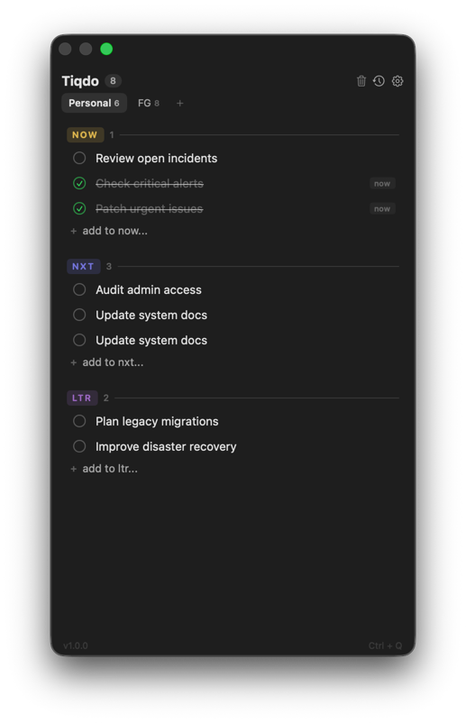

# Tiqdo

A minimal, native macOS menu bar task manager built around the **Now / Nxt / Ltr** prioritization system.



## Philosophy

Most to-do apps fail because of poor structure, not lack of discipline. Tiqdo fixes this with three simple lanes:

- **NOW** — What needs your attention today. Keep it to 3-5 tasks.
- **NXT** — Tomorrow's priorities, captured today. Your next move is already waiting.
- **LTR** — Parked, not forgotten. Ideas and future plans for when the time comes.

Drag between lanes as priorities shift. That's it.

## Features

- **Menu bar native** — One click to open, one click to close. No dock icon, no window clutter.
- **Three-lane system** — NOW / NXT / LTR with drag & drop between lanes and reordering within.
- **Multiple tabs** — Up to 4 separate contexts (Work, Personal, Home, ...), each with its own lanes.
- **Global shortcut** — `Ctrl+Q` summons Tiqdo from any app, including fullscreen.
- **Tab switching** — `Ctrl+Tab` cycles through tabs instantly.
- **Dark UI** — Purpose-built dark interface with colored lane badges.
- **Resizable** — Drag the edge to resize. Size is remembered between sessions.
- **Completed task cleanup** — Trash button clears done tasks. Tasks completed over 24h ago are auto-removed.
- **Task completion history** — Browse completed tasks grouped by day. Configurable retention up to 10,000 records.
- **100% private** — No accounts, no cloud, no analytics. All data stays on your Mac in Application Support.
- **Launch at login** — Optional, configurable in settings.

## Keyboard Shortcuts

| Shortcut | Action |
|---|---|
| `Ctrl+Q` | Toggle Tiqdo (global, works from any app) |
| `Ctrl+Tab` | Switch to next tab |
| `Enter` | Confirm new task / save edit |
| `Escape` | Cancel edit / close panel |

## Requirements

- macOS 14.0 (Sonoma) or later
- Apple Silicon or Intel Mac
- Xcode Command Line Tools (`xcode-select --install`)

## Install with Homebrew

```bash
brew install --cask petrfilip/tap/tiqdo
tiqdo
```

Homebrew downloads a versioned, checksum-verified source archive, builds and
ad-hoc signs the app locally, installs it in `/Applications`, and adds the
`tiqdo` launcher. No Apple Developer Program membership or additional Swift
packages are required.

To update or uninstall:

```bash
brew update
brew upgrade --cask tiqdo
brew uninstall --cask tiqdo
```

Tasks and history in `~/Library/Application Support/Tiqdo` are preserved.
The bundle identifier is `cz.tix.tiqdo`. On first launch, preferences from the
old `cz.fg.tiqdo` installation are copied if the new app has no preferences yet.
If you previously installed with `./build.sh --install`, quit Tiqdo and remove
only the old `/Applications/Tiqdo.app` symlink before installing with Homebrew.

## Build & Install

```bash
git clone https://github.com/petrfilip/Tiqdo.git
cd Tiqdo
./build.sh
```

The script compiles the project with `swiftc` and creates an app bundle at `.build/Tiqdo.app`.

To install a symlink to `/Applications/Tiqdo.app`:

```bash
./build.sh --install
```

To launch:

```bash
./build.sh --launch
```

On first launch, macOS may block the app. Go to **System Settings > Privacy & Security > Open Anyway**.

## Checks and releases

Run `bin/test` to check preference migration and build script validation.
Set `APP_VERSION` and `BUILD_NUMBER` when building another release:

```bash
APP_VERSION=1.0.1 BUILD_NUMBER=2 ./build.sh
```

Publish each source archive once in this repository's GitHub Releases, then
update the version and SHA-256 in the tap's `Casks/tiqdo.rb`. Never replace an
existing release archive; publish a new version instead.

## License

MIT
